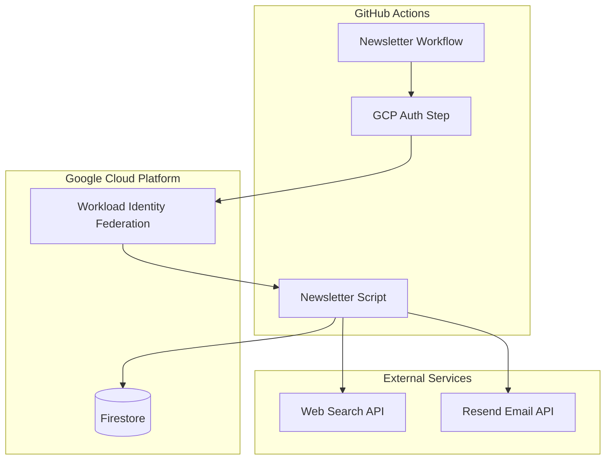
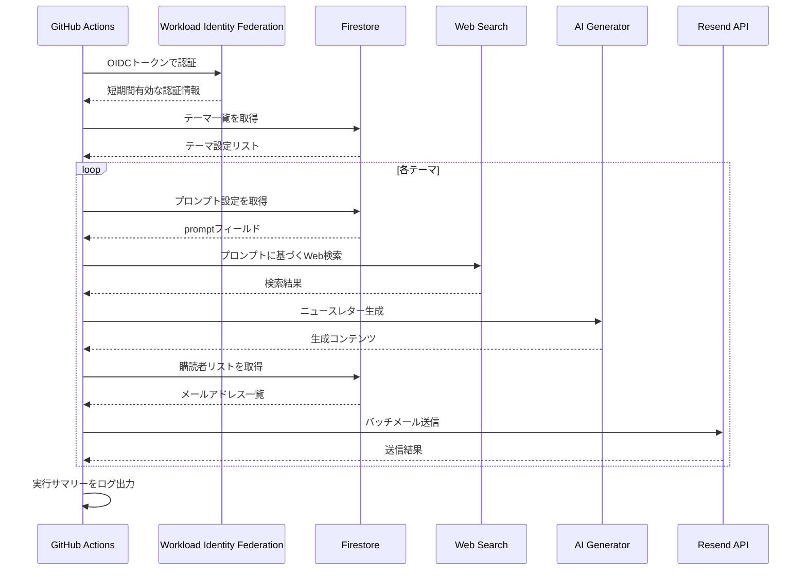
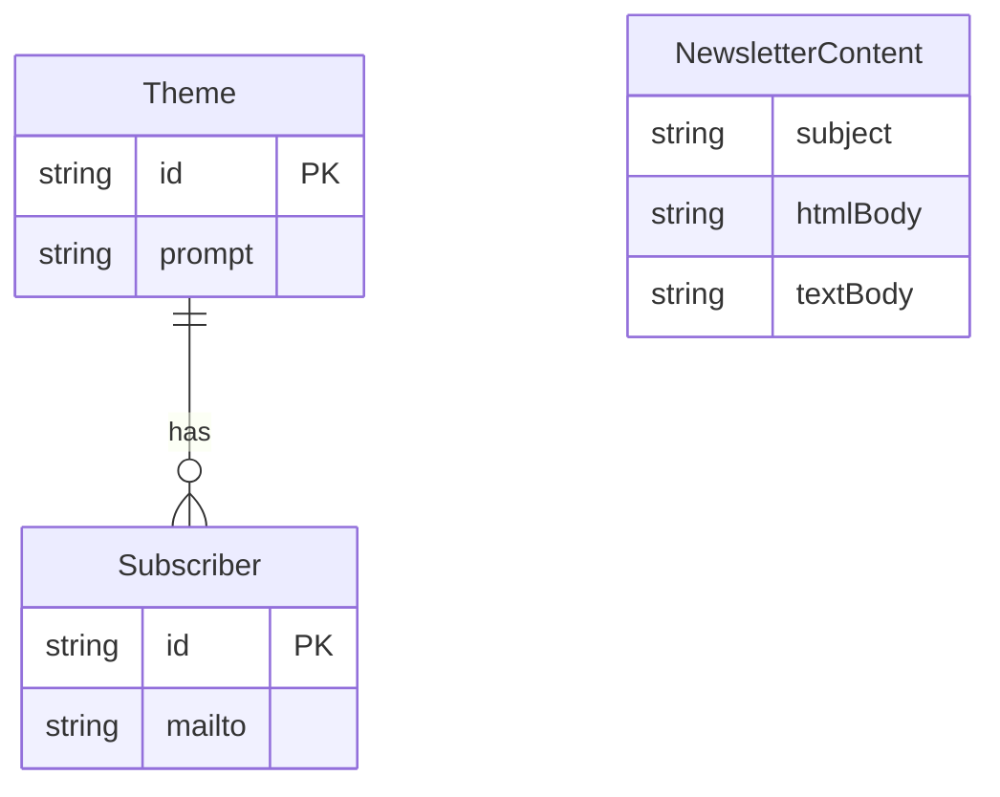

# Technical Design Document

## Overview

**Purpose**: GitHub Actionsを使用してニュースレターを自動生成・配信し、システム管理者のコンテンツ作成作業を削減する。

**Users**: システム管理者がテーマ設定と購読者管理を行い、購読者が定期的にニュースレターを受信する。

**Impact**: Firestoreに保存されたテーマ設定に基づいてWeb検索を実行し、生成されたニュースレターをResend API経由で購読者に自動配信する。

### Goals
- Firestoreのテーマ設定に基づくニュースレター自動生成
- Resend APIを使用した購読者へのメール配信
- Workload Identity Federationによるセキュアな認証
- 毎週月曜日9時（JST）の自動実行とオンデマンド実行のサポート

### Non-Goals
- Webベースの管理画面の提供（Firestore直接管理を想定）
- 購読者の自己登録・解除機能
- メール配信のトラッキング・分析機能
- ニュースレターテンプレートのカスタマイズUI

## Architecture

### Architecture Pattern & Boundary Map



**Architecture Integration**:
- **Selected pattern**: レイヤードアーキテクチャ（簡易版）— Infrastructure層（外部サービス連携）とApplication層（ビジネスロジック）を分離
- **Domain boundaries**: NewsletterGenerator（コンテンツ生成）、EmailSender（メール送信）、FirestoreConnector（データアクセス）
- **Existing patterns preserved**: N/A（新規プロジェクト）
- **New components rationale**: 各外部サービスとの連携を独立したコネクタとして実装し、テスト容易性と保守性を確保

### Technology Stack

| Layer | Choice / Version | Role in Feature | Notes |
|-------|------------------|-----------------|-------|
| Infrastructure / Runtime | GitHub Actions (Ubuntu Latest) | ワークフロー実行環境 | Node.js 20.x LTSを使用 |
| Backend / Services | TypeScript 5.x | アプリケーション実装言語 | 型安全性確保 |
| Data / Storage | Cloud Firestore | テーマ設定・購読者リスト管理 | `@google-cloud/firestore` SDK |
| Messaging / Events | Resend API v1 | メール送信 | `resend` パッケージ v6.x |
| Infrastructure / Runtime | Workload Identity Federation | GCP認証 | `google-github-actions/auth@v3` |

## System Flows

### ニュースレター生成・配信フロー



**Key Decisions**:
- テーマごとに逐次処理（エラー分離のため）
- Web検索失敗時は3回リトライ後にスキップ
- メール送信はバッチ処理（レート制限対応）

## Requirements Traceability

| Requirement | Summary | Components | Interfaces | Flows |
|-------------|---------|------------|------------|-------|
| 1.1 | Firestoreからプロンプト設定取得 | FirestoreConnector | ThemeService | テーマ取得 |
| 1.2 | プロンプトに基づくWeb検索 | NewsletterGenerator | WebSearchService | Web検索 |
| 1.3 | 検索結果からニュースレター生成 | NewsletterGenerator | ContentGeneratorService | コンテンツ生成 |
| 1.4, 1.5 | エラー処理とリトライ | NewsletterGenerator | - | エラーハンドリング |
| 2.1, 2.3 | Resend APIでメール送信 | EmailSender | EmailService | バッチ送信 |
| 2.2 | 送信先リスト取得 | FirestoreConnector | SubscriberService | 購読者取得 |
| 2.4, 2.5 | 送信エラー・空リスト処理 | EmailSender | - | エラーハンドリング |
| 3.1, 3.2, 3.3 | Firestoreデータアクセス | FirestoreConnector | FirestoreClient | データ取得 |
| 3.4 | Firestore接続エラー処理 | FirestoreConnector | - | エラーハンドリング |
| 4.1, 4.2, 4.3 | WIF認証 | GitHubActionsWorkflow | AuthService | 認証フロー |
| 4.4 | 認証エラー処理 | GitHubActionsWorkflow | - | 認証失敗 |
| 5.1 | cronスケジュール実行 | GitHubActionsWorkflow | - | スケジュール |
| 5.2 | 手動トリガー | GitHubActionsWorkflow | - | workflow_dispatch |
| 5.3, 5.4 | 全テーマ処理とサマリー | NewsletterGenerator | - | ループ処理 |
| 6.1, 6.2, 6.3 | シークレット・環境変数管理 | GitHubActionsWorkflow | - | 設定管理 |
| 6.4 | 必須設定チェック | GitHubActionsWorkflow | - | バリデーション |

## Components and Interfaces

| Component | Domain/Layer | Intent | Req Coverage | Key Dependencies (P0/P1) | Contracts |
|-----------|--------------|--------|--------------|--------------------------|-----------|
| GitHubActionsWorkflow | Infrastructure | ワークフロー定義と認証 | 4.1-4.4, 5.1-5.4, 6.1-6.4 | google-github-actions/auth (P0) | Batch |
| FirestoreConnector | Infrastructure | Firestoreデータアクセス | 1.1, 2.2, 3.1-3.4 | @google-cloud/firestore (P0) | Service |
| NewsletterGenerator | Application | コンテンツ生成ロジック | 1.1-1.5, 5.3-5.4 | WebSearchService (P1), ContentGeneratorService (P1) | Service |
| EmailSender | Application | メール送信ロジック | 2.1-2.5 | Resend SDK (P0) | Service |

### Infrastructure Layer

#### GitHubActionsWorkflow

| Field | Detail |
|-------|--------|
| Intent | GitHub Actionsワークフロー定義、認証、スケジュール管理 |
| Requirements | 4.1, 4.2, 4.3, 4.4, 5.1, 5.2, 5.3, 5.4, 6.1, 6.2, 6.3, 6.4 |

**Responsibilities & Constraints**
- Workload Identity Federationを使用したGCP認証
- cronスケジュール（毎週月曜0:00 UTC = JST 9:00）とworkflow_dispatchトリガー
- 環境変数とシークレットの管理
- Node.js環境のセットアップ

**Dependencies**
- External: google-github-actions/auth@v3 — GCP認証 (P0)
- External: actions/checkout@v4 — リポジトリチェックアウト (P0)
- External: actions/setup-node@v4 — Node.jsセットアップ (P0)

**Contracts**: Batch [x]

##### Batch / Job Contract
- **Trigger**: cronスケジュール `0 0 * * 1` (毎週月曜0:00 UTC) または workflow_dispatch
- **Input / validation**:
  - Required secrets: `RESEND_API_KEY`, `WORKLOAD_IDENTITY_PROVIDER`, `SERVICE_ACCOUNT_EMAIL`
  - Required vars: `GCP_PROJECT_ID`
- **Output / destination**: ログ出力（処理結果サマリー）
- **Idempotency & recovery**: 各テーマは独立処理、失敗テーマはスキップして継続

**Implementation Notes**
- Integration: `google-github-actions/auth`の出力を`GOOGLE_APPLICATION_CREDENTIALS`に設定
- Validation: ワークフロー開始時に必須シークレットの存在確認
- Risks: IAM権限伝播に最大5分かかる場合がある

---

#### FirestoreConnector

| Field | Detail |
|-------|--------|
| Intent | Firestoreからのテーマ設定と購読者データの読み取り |
| Requirements | 1.1, 2.2, 3.1, 3.2, 3.3, 3.4 |

**Responsibilities & Constraints**
- `/themes/{theme-id}`コレクションからテーマ設定を取得
- `/themes/{theme-id}/mailto/`サブコレクションから購読者リストを取得
- 読み取り専用アクセス（書き込み権限不要）

**Dependencies**
- External: @google-cloud/firestore — Firestore SDK (P0)
- Inbound: GitHubActionsWorkflow — 認証情報提供 (P0)

**Contracts**: Service [x]

##### Service Interface
```typescript
interface Theme {
  id: string;
  prompt: string;
}

interface Subscriber {
  mailto: string;
}

interface FirestoreConnector {
  getThemes(): Promise<Theme[]>;
  getThemeById(themeId: string): Promise<Theme | null>;
  getSubscribers(themeId: string): Promise<Subscriber[]>;
}
```
- Preconditions: GCP認証が完了していること
- Postconditions: 取得したデータを型安全に返却
- Invariants: Firestoreコレクション構造は固定

**Implementation Notes**
- Integration: Application Default Credentialsを使用
- Validation: テーマIDの存在確認、空のpromptフィールドをエラーとして扱う
- Risks: Firestore接続タイムアウト時はワークフロー全体を失敗

---

### Application Layer

#### NewsletterGenerator

| Field | Detail |
|-------|--------|
| Intent | Web検索とAIを使用したニュースレターコンテンツ生成 |
| Requirements | 1.1, 1.2, 1.3, 1.4, 1.5, 5.3, 5.4 |

**Responsibilities & Constraints**
- テーマのプロンプトに基づくWeb検索の実行
- 検索結果からニュースレターコンテンツの生成
- エラー発生時のリトライとスキップ処理

**Dependencies**
- Outbound: FirestoreConnector — テーマ設定取得 (P0)
- External: WebSearchService — Web検索実行 (P1)
- External: ContentGeneratorService — コンテンツ生成 (P1)

**Contracts**: Service [x]

##### Service Interface
```typescript
interface NewsletterContent {
  subject: string;
  htmlBody: string;
  textBody: string;
}

interface GenerationResult {
  themeId: string;
  success: boolean;
  content?: NewsletterContent;
  error?: string;
}

interface NewsletterGenerator {
  generateForTheme(theme: Theme): Promise<GenerationResult>;
  generateAll(): Promise<GenerationResult[]>;
}
```
- Preconditions: テーマにpromptフィールドが存在すること
- Postconditions: 成功時はNewsletterContent、失敗時はエラー情報を含むResult
- Invariants: リトライ回数は最大3回

**Implementation Notes**
- Integration: Web検索APIとAI生成APIの具体的な実装は別途決定
- Validation: プロンプト文字列の最小長チェック
- Risks: 外部API依存のため、障害時は当該テーマをスキップ

---

#### EmailSender

| Field | Detail |
|-------|--------|
| Intent | Resend APIを使用したニュースレターのバッチ送信 |
| Requirements | 2.1, 2.2, 2.3, 2.4, 2.5 |

**Responsibilities & Constraints**
- Resend APIを使用したメール送信
- 購読者リストへのバッチ送信（最大100件/リクエスト）
- レート制限対応（2リクエスト/秒）

**Dependencies**
- Outbound: FirestoreConnector — 購読者リスト取得 (P0)
- External: Resend SDK — メール送信 (P0)

**Contracts**: Service [x]

##### Service Interface
```typescript
interface SendResult {
  themeId: string;
  totalRecipients: number;
  successCount: number;
  failedRecipients: string[];
  errors: string[];
}

interface EmailSender {
  send(themeId: string, content: NewsletterContent): Promise<SendResult>;
}
```
- Preconditions: RESEND_API_KEYが設定されていること、FROM_EMAIL（送信者メールアドレス）が設定されていること、購読者リストが存在すること
- Postconditions: 送信結果を返却、部分的な失敗も報告
- Invariants: バッチサイズは100件以下

**Implementation Notes**
- Integration: `resend` SDKのbatch.sendメソッドを使用
- Validation: メールアドレス形式の検証
- Risks: レート制限超過時は429エラー、バックオフ後リトライ

## Data Models

### Domain Model



**Aggregates and Boundaries**:
- Theme: テーマ設定のルートエンティティ
- Subscriber: テーマに紐づく購読者（1対多）
- NewsletterContent: 生成されたコンテンツ（永続化しない一時オブジェクト）

**Business Rules & Invariants**:
- テーマにはpromptが必須
- 購読者にはmailtoが必須（有効なメールアドレス形式）

### Physical Data Model

**Firestore Collection Structure**:

```
/themes/{theme-id}
  - prompt: string  // ニュースレター生成用プロンプト

/themes/{theme-id}/mailto/{subscriber-id}
  - mailto: string  // 購読者メールアドレス
```

**Index Requirements**:
- デフォルトインデックスで十分（単一フィールドクエリのみ）

## Error Handling

### Error Strategy

| Error Type | Category | Response | Recovery |
|------------|----------|----------|----------|
| Firestore接続エラー | System (5xx) | ワークフロー失敗 | 再実行 |
| テーマ設定不存在 | Business (422) | 警告ログ、テーマスキップ | 設定修正 |
| Web検索失敗 | System (5xx) | 3回リトライ後スキップ | 次回実行で再試行 |
| Resend APIエラー | System (5xx) | エラーログ、失敗報告 | 手動対応 |
| レート制限 | System (429) | バックオフ後リトライ | 自動回復 |
| 空の購読者リスト | Business (422) | 警告ログ、正常終了 | 購読者追加 |
| 認証失敗 | Security (401) | ワークフロー停止 | 設定確認 |

### Monitoring

- GitHub Actionsの実行ログで全エラーを記録
- 失敗したテーマと購読者を実行サマリーに出力
- ワークフロー失敗時はGitHub通知を活用

## Testing Strategy

### Unit Tests
- FirestoreConnector: モックを使用したデータ取得テスト
- NewsletterGenerator: 各種エラーケースのハンドリングテスト
- EmailSender: バッチ分割ロジック、レート制限対応テスト
- 入力バリデーション: メールアドレス形式、プロンプト文字列

### Integration Tests
- Firestore接続: エミュレータを使用した読み取りテスト
- Resend API: サンドボックス環境での送信テスト
- End-to-end: テーマ取得からメール送信までの一連フロー

### E2E Tests
- ワークフロー実行: 手動トリガーでの全体動作確認
- エラーシナリオ: 認証失敗、Firestore接続失敗時の挙動

## Security Considerations

### Authentication & Authorization
- Workload Identity Federation: サービスアカウントキー不使用
- OIDCトークン: 短期間有効（GitHub OIDCは5分、GCPトークンはデフォルト1時間）
- 最小権限原則: Firestoreは読み取り権限のみ

### Secrets Management
- RESEND_API_KEY: GitHub Secretsで管理
- FROM_EMAIL: GitHub Secretsで管理（送信者メールアドレス、例: `newsletter@yourdomain.com`）
- WORKLOAD_IDENTITY_PROVIDER: GitHub Secretsで管理
- SERVICE_ACCOUNT_EMAIL: GitHub Secretsで管理
- GCP_PROJECT_ID: GitHub Variablesで管理（機密性低）

### Data Protection
- メールアドレス: Firestoreで管理、ログには記録しない
- 認証情報: ワークフロー実行時のみメモリに保持

## Performance & Scalability

### Target Metrics
- 実行時間: テーマあたり30秒以内（Web検索・生成・送信）
- 総実行時間: 10テーマで5分以内

### Scaling Considerations
- テーマ数増加: 現状は逐次処理、100テーマ超で並列化検討
- 購読者数増加: バッチ送信（100件/リクエスト）で対応
- レート制限: Resendへの増枠リクエストで対応可能

### Optimization
- バッチ送信: 1リクエストで最大100件送信
- 失敗テーマのスキップ: 他テーマへの影響を防止
